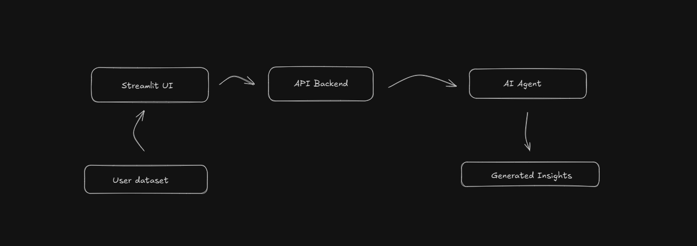
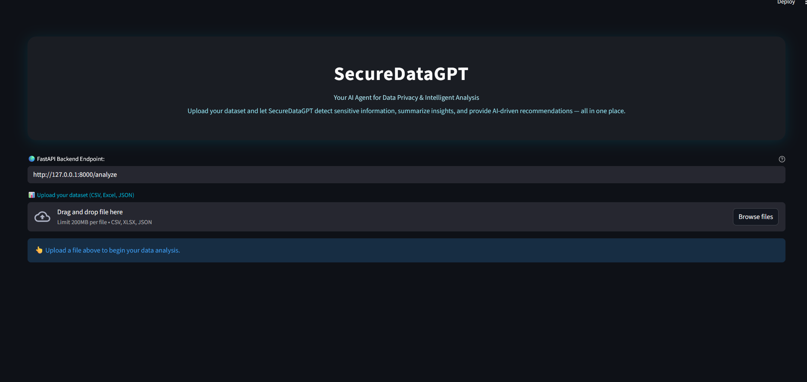

# SecureDataGPT

**SecureDataGPT** is an AI-powered agent that analyzes datasets to detect sensitive information, generate concise insights, and recommend data privacy improvements — built for analysts, researchers, and security teams who care about responsible data use.

---

## 🌐 Overview

SecureDataGPT combines **FastAPI** and **Streamlit** to create an intelligent assistant that:
- ⚙️ Scans structured datasets (CSV, Excel, JSON)
- 🧠 Uses LLM (via OpenRouter API) for natural-language summarization and recommendations
- 🔒 Detects potentially sensitive patterns (emails, credentials, identifiers, etc.)
- 📊 Generates a clean, interactive report within seconds

This project demonstrates **AI-driven data governance and privacy auditing** using modern MLOps and API integration practices.

---

##  Architecture



- **Frontend:** Streamlit (modern dark UI, responsive layout)
- **Backend:** FastAPI (secure REST API for file handling and inference)
- **LLM Engine:** OpenRouter API (GPT-based models)
- **Data Processing:** pandas for structured data inspection

---

##  Quick Start

### 1️⃣ Clone the repository
```bash
git clone https://github.com/yourusername/SecureDataGPT.git
cd SecureDataGPT
````

### 2️⃣ Run the backend (FastAPI)

```bash
uvicorn app.main:app --reload
```

### 3️⃣ Launch the frontend (Streamlit)

```bash
streamlit run app_ui.py
```

Then open: [http://localhost:8501](http://localhost:8501)

---

## Preview

### 🔹 Interface





### 🔹 Agent in Action

* analysis process :


---

## 🧠 How It Works

1. The user uploads a dataset (`CSV`, `Excel`, or `JSON`)
2. The backend preprocesses the file and detects potential sensitive fields
3. The LLM agent generates:

   * A concise data summary
   * A list of potential risks
   * Actionable recommendations to improve data safety
4. The Streamlit UI presents these results in a clean, modern dark interface

---

## 🧰 Tech Stack

| Layer               | Technology                   |
| ------------------- | ---------------------------- |
| **Frontend**        | Streamlit                    |
| **Backend**         | FastAPI                      |
| **AI / NLP**        | OpenRouter API (GPT-4o-mini) |
| **Data Processing** | pandas                       |
| **Language**        | Python 3.10+                 |

---

## 💡 Use Cases

* Internal **data audits** before model training
* **Privacy compliance** checks (PII detection)
* Quick AI-assisted **insight generation** from structured data
* Educational demonstration of **AI-Security integration**

---

## 🧭 Future Enhancements

* Support for **multi-file projects**
* Integration with **vector databases** for contextual awareness
* Auto-redaction of sensitive values
* Report export (PDF / Markdown)

---

## 📚 Project Value

SecureDataGPT bridges the gap between **AI explainability** and **data security**.
It’s a showcase of how LLMs can assist in responsible AI practices — detecting, understanding, and securing data in real time.

---

## 🧑‍💻 Author

**[saman barahoie]** — AI & Cybersecurity Engineer
💬 Blending security intelligence with machine learning to create smarter, safer systems.

---

## 🪄 License

This project is released under the MIT License.


